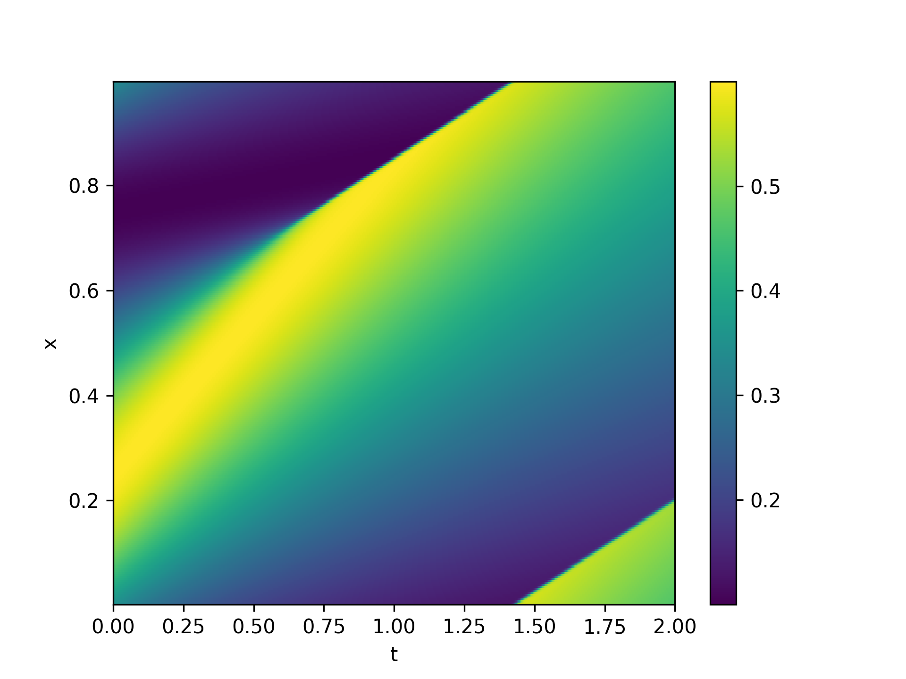

# Burgers

## Homework 3 for PHYS 776

A collection of functions that solve the inviscid Burgers' equation in 1 + 1 dimensions. Fluxes are calculated using Roe's method, and three types of slope calculations are available: 'minmod', 'linear', and 'constant'.
- 'minmod' uses the minmod slope limiter
- 'linear' uses no slope limiter
- 'constant' uses a slope of 0 in every cell

Time integration is done using Runge-Kutta 2 method. The `DataInterpolations` package is used for cubic spline interpolation of the solution.

## Instructions

The resolution of a solution is chosen using a `Resolution` instance. The type of slope calculation is chosen as a `SlopeCalc` instance, and can be one of `minmod`, `linear`, or `constant`. Note that, of the three, only the `minmod` choice is stable. Also needed is a function that accepts and returns a `Vector` of regularly spaced *x*-values.

### Example

```Julia
using Burgers
using PyPlot
include("Utils.jl")
using .Utils

# create the Resolution
Ttot     = 2.0   # total duration
Nt_b     = 1024  # number of time divisions for lowest resolution
Ncells_b = 256   # number of position divisions for lowest resolution
Nghost   = 2     # padding on position divisions for boundary conditions
res = Resolution{Float64, Int64}(Ttot, Nt_b, Ncells_b, Nghost)

# choose the slope calculation method
sc = minmod::SlopeCalc

# find the evolved solution
# if t0 is a Float64, 'get_evolved_slice' returns u(x) at the time t0
# if t0 is an Int64,  'get_evolved_slice' returns u(x) at the t0^th time step
ufun = get_evolved_slice(get_sinewave, res, t0, sc)

# plot u(x)
xlabel("x")
xlabel("u")
plot(ufun.xdat, ufun.udat)
```

## Colormaps of Solutions

The file 'colormap.jl' produces a colormap of the solution *u(x, t)* to the inviscid Burgers equation for points *(x, t)* on [0, 1]*x*[0, *T*]. These solutions are calculated using the minmod slope limiter. The first is initialized using *u(x, 0)* = 0.35 + 0.25sin(2&pi;*x*), and the second using *u(x, 0)* = 0.35 + 0.25sin(4&pi;*x*). The remained of the discussion will be done using the former.




## Solutions at Different Times

At early times, *u(x)* is still relatively smooth. After a certain amount of time, shocks form, and a discontinity in the solution appears. Below, we show *u(x)* at times *t = 0.125* (top figure) and *t = 0.75* (bottom figure).


## Pointwise Convergence

To calculate the pointwise convergence, we use equation (4) in [1], with &alpha; = 1/2, and take the binary logarithm of the result, which we call *C(x)*. The value of *C(x)* indicates the pointwise convergence order.

The first figure below is *C(x)* at *t = 0.125*, calculated using the linear slope calculator. Before the shocks form, the linear slope calculator gives first order convergence. The two dips are caused by numerical instabilities in the denominator of equation (4) in [1], and are located at the zeros of the derivative of *u(x)*.


The second figure is *C(x)* at *t = 0.125*, calculated using the minmod slope limiter. The behaviour near *x = 0.33* and *x = 0.76* is more drastic than it was for the linear slope calculator. This is caused by a combination of (1) the same issue with the denominator mentioned earlier and (2) how the minmod slope limiter behaves near changes in slope. Near smooth zeros, the linear calculation gives a more accurate slope than the minmod limiter, which sets the value to exactly zero.


The third figure is *C(x)* at *t = 0.75*, calculated using the minmod slope limiter. The convergence is very unstable around *x = 0.75*, which, as can be seen in an earlier figure, is where the shock in *u(x)* is located.


It should be noted that, even in regions where *C(x)* is well-behaved, it only achieves first order convergence. I was unable to find the expected second-order convergence. Meanwhile, the linear slope calculator was too unstable to work at all after shocks form.

## References

[1] http://www.csc.kth.se/utbildning/kth/kurser/DN2255/ndiff13/ConvRate.pdf
